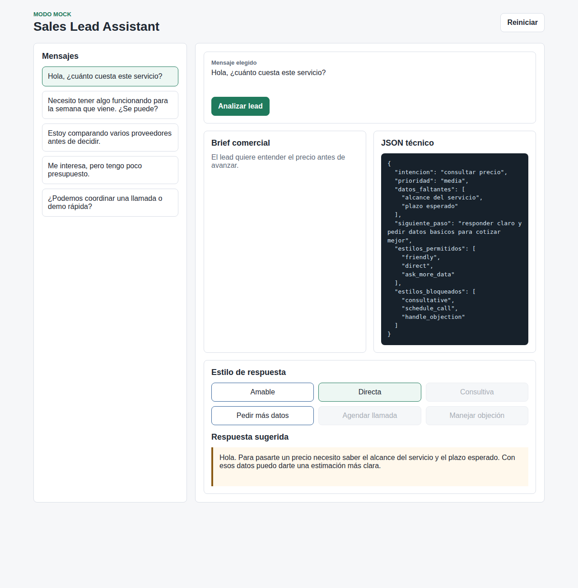
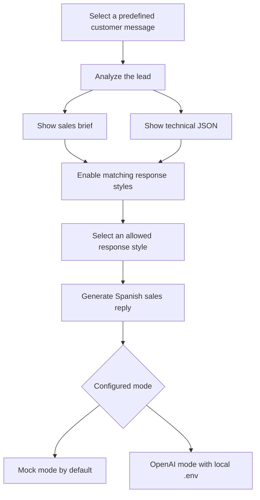

# Sales Lead Assistant

Sales Lead Assistant is a web demo that simulates a sales assistant for inbound leads.

The app lets a user choose a predefined customer message, analyze the lead, review a sales brief, inspect a technical JSON response, and generate a sales reply in Spanish using only the response styles that match the selected message.

## Preview



## Workflow



## Features

- Predefined lead messages.
- Lead analysis with sales brief and technical JSON.
- Context-aware response styles.
- Disabled response styles when they do not apply.
- Spanish sales replies.
- Mock mode by default.
- Optional OpenAI mode using local environment variables.

## Stack

- Backend: FastAPI
- Frontend: HTML, CSS, JavaScript
- AI provider: mock by default, OpenAI optional

## Run locally

Install dependencies:

```bash
source .venv/bin/activate
pip install -r requirements.txt
```

Start the backend:

```bash
uvicorn backend.main:app --host 127.0.0.1 --port 8000
```

Start the frontend in another terminal:

```bash
python3 -m http.server 4173 --directory frontend
```

Open:

```text
http://127.0.0.1:4173
```

## Configuration

The project uses mock mode by default.

Example `.env` for mock mode:

```env
APP_MODE=mock
OPENAI_API_KEY=
OPENAI_MODEL=gpt-4o-mini
```

Example `.env` for local OpenAI mode:

```env
APP_MODE=openai
OPENAI_API_KEY=your_local_api_key
OPENAI_MODEL=gpt-4o-mini
```

Do not commit real API keys. The repository includes `.env.example` with fake values only.

## API endpoints

```text
GET /health
GET /config
GET /mensajes
GET /estilos
GET /analizar/{id_mensaje}
GET /responder/{id_mensaje}/{id_estilo}
```

## Product decisions

- The public demo does not use unlimited free-text input.
- Invalid response styles are blocked in the frontend and validated again in the backend.
- The visible interface and generated replies are in Spanish.
- The technical JSON is visible so the API response shape can be inspected.
- Mock mode keeps the demo safe to run without API keys or external costs.
